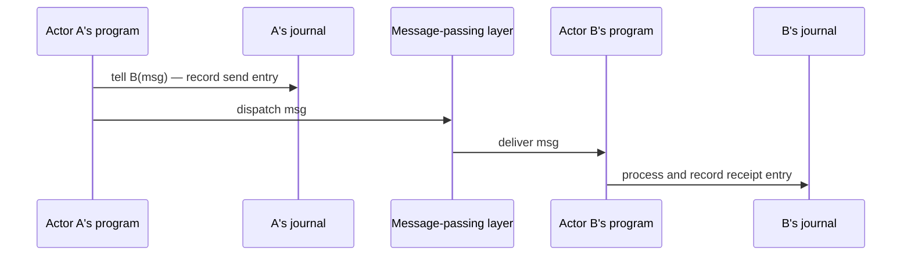

# Preserving semantic continuity across actors

## TL;DR

> The actor model treats cross-actor causation as operational — message dispatch by a runtime, not a statement in any actor's program. The treatment is not entailed by the model; it is a contingent design decision adopted in the canonical sources fifty years ago and never seriously challenged. The cost is structural: an entire ecosystem of compensating patterns — sagas, choreography, distributed tracing, workflow engines — exists to reconstruct cross-actor causal chains that no actor's program records.
>
> This paper observes that the assumption can be removed without altering any structural commitment of the actor model. Three conditions describe a system in which the cross-actor send is recorded as a sentence in the sender's program: locality of writes (each journal records only its own actor's activity), causation as program statement (the cross-actor send is a sentence in the sender's journal), and no external coordinator (no party outside the participating actors decides what happens next). Any primitive satisfying these three conditions dissolves the assumption. *Tell* — a primitive in the Puppeteer framework — is one such realization.
>
> Three labs are exhibited side by side on the same domain (saga, choreography, tell). The reader sees, in journals, that the saga places the joint history in a coordinator's program, that the choreography places it in an external bus log, and that the tell instantiation places it in the sender's own program. Three additional tests demonstrate that under tell the journal alone supports replay reconstruction, cross-datacenter replication, and audit query — operations that require external apparatus under the assumption. **Forty years of convention are not forty years of necessity.**

---

## Claims this paper makes

1. **The assumption named.** Cross-actor causation has been treated as operational rather than programmatic across fifty years of canonical actor-systems literature — from Hewitt 1973 through Akka and Orleans. *(Verification: §2 + the genealogy table in §2.4.)*

2. **The assumption is contingent.** No theorem of the actor model entails it. The three structural commitments of the model — autonomy, message-based communication, isolation — define the ontology of actors, not the mechanics of their runtimes. *(Verification: §4.)*

3. **Three conditions resolve the assumption.** Locality of writes (C1), causation as program statement (C2), and no external coordinator (C3) describe a system in which semantic continuity is preserved across actors without violating any of the actor model's commitments. The conditions are not design choices; they are the minimal consequences of reconciling the model's commitments with the construct. *(Verification: §7.1.)*

4. **Any primitive satisfying C1+C2+C3 dissolves the assumption.** The contribution is conceptual; the realization is one of many possible. An actor framework whose programs do not currently record cross-actor sends could, in principle, be extended to satisfy the three conditions. *(Verification: §7.5.)*

5. **The actor model's commitments survive the reformulation intact.** Autonomy, message-based communication, and isolation each remain unchanged; only the historical interpretation of what each actor's program is *permitted to say* is removed. *(Verification: §7.3.)*

6. **The compensating ecosystem exists because of the assumption.** Saga orchestrators, event-driven choreography, distributed tracing, and workflow engines each compensate, in their own way, for the absence of cross-actor causation in any actor's program. Their sophistication, maturity, and widespread adoption are evidence of the cost of the assumption, not of its correctness. *(Verification: §6 + the side-by-side labs in §8.3.)*

7. **Tell exhibits the conditions in production.** A Reaction whose `.Causation.Continue(...)` body issues a `tell` writes one journal entry on the sender's side; the receiver's acknowledgment closes the round-trip in a second entry. The sender's journal becomes a self-contained record of what crossed the actor boundary. *(Verification: §8.2 + §8.3 Style 3.)*

8. **Auditing the cross-actor narrative becomes reading the program.** The journal shows what was sent, to whom, with what content, at what time, and with what acknowledgment — without correlation IDs, distributed tracing, or external aggregation. *(Verification: §8.5 G3.)*

9. **Replay reconstructs cross-actor state from the journal alone.** A fresh actor with no shared transport and no live receiver, replaying the journal, reconstructs the in-flight tell state. *(Verification: §8.5 G1.)*

10. **Cross-datacenter replication preserves the cross-actor causal chain.** The journal carries the cross-actor causation across data centers because the causation was always recorded in a place replication can carry. *(Verification: §8.5 G2.)*

---

## 1. Introduction

This paper makes a design theory contribution. It identifies and names a structural assumption that the canonical literature on actor-based systems has repeatedly documented in different forms without recognizing as a single construct; derives the design principles required to reject it; and presents an instantiation — a system in which those principles have been realized in production — as confirmation that the construct is realizable. The contribution is conceptual; the instantiation serves as an existence proof, not as the substance of the claim. The genre is that described by Alan Hevner, Stuart March, Jinsoo Park, and Sudha Ram (2004) as design science research: empirical evidence is provided in the form of a working artifact rather than a controlled experiment.

This is not a systems paper. It does not present performance benchmarks, fault-injection metrics, or latency comparisons against existing actor frameworks. The genre — design theory — measures contribution by the precision of the construct, the validity of the principles, and the realizability of the instantiation. Section 8 exhibits the instantiation and tests whether the mechanism satisfies its stated structural properties. Readers expecting quantitative comparisons against alternatives will find structural comparisons — what each pattern records, where the joint history lives — in §6 and §8.4.

Consider an ordinary observation about actor-based systems. An actor performs an operation and, as a result, sends a message to another actor. The first actor's operation, state mutation, and emitted events appear in its journal or trace. The second actor receives the message and its own operation is likewise recorded. Yet the act of sending the message — the causal step that connects the two — does not appear in either actor's program. It is mediated by the runtime, the dispatcher, or the message broker. The sender's journal does not record that it spoke; the receiver's journal does not record, in program terms, who spoke to it.

This observation is so familiar that it rarely appears noteworthy. But it should. If actors are programs, and a sentence in one actor's program causes an effect in another, then that causal sentence has every reason to appear as part of the first actor's program. That it does not is not a logical consequence of the actor model; it is a structural feature of how actor systems have historically been constructed.

This paper names that gap. The construct introduced is *semantic continuity*: the property of a program (in the substrate-level sense established in Paper 2 §1.2: the pair of domain library and journal of invocations) whose causal structure remains recorded as part of the program itself, even when its effects cross boundaries. The defect identified is the absence of semantic continuity at actor boundaries. The principles derived are the conditions under which semantic continuity can be preserved without violating actor isolation and without introducing orchestration. The instantiation presented is *tell*, a primitive in which the cross-actor send is recorded as a sentence of the sender's journal.

§2 traces the genealogy of the assumption that produces this gap, showing that across five decades and multiple canonical generations of literature the assumption has remained continuous in substance though varied in form. §3 names the assumption explicitly: *causation between actors is treated as operational rather than programmatic*. §4 demonstrates that this assumption is contingent rather than necessary — no theorem of the actor model entails it. §5 examines the architectural and operational consequences of the assumption. §6 shows why existing responses to those consequences — sagas, choreography, distributed tracing, and workflow engines — cannot dissolve the assumption, because they reconstruct cross-actor flow after the fact rather than preserving it as program. §7 reformulates the model: under three explicit conditions, semantic continuity can be preserved across actors. §8 presents the instantiation, *tell*, through a comparative case study against saga and choreography implementations of the same domain. §9 relates the construct to prior work in this paper series. §10 concludes.

---

## 2. Genealogy

### 2.1 The founding decision (1970s)

The actor model was introduced in 1973 by Hewitt, Bishop, and Steiger as a unifying account of concurrent computation in which "all of the modes of behavior can be defined in terms of one kind of behavior: sending messages to actors" [Hewitt et al. 1973, p. 235]. Sending messages is positioned as a universal primitive, but the framing goes further: it is positioned as a *machine-level* primitive. "The basic unit of execution on an actor machine is sending a message in much the same way that the basic unit of execution on present day machines is an instruction" [ibid., p. 236]. The act of sending is therefore parallel to a hardware instruction — it is what the abstract machine performs *between* actors, not content of any actor's program.

A parallel tradition emerged in 1978 with Hoare's *Communicating Sequential Processes* [Hoare 1978]. Where the actor model offered messages between named actors, CSP offered input and output as basic primitives of programming and synchronized parallel composition as a fundamental program structuring method. Processes are independent; their communication occurs at named ports through a symmetric handshake. The handshake is a feature of the language, not a statement in either process's program.

The actor model was formalized in 1986 in Agha's MIT thesis [Agha 1986], which defined actors as behavior functions over messages and treated cross-actor effects as emitted output messages of the function. The formal account ratified what Hewitt 1973 had stated informally: an actor's program describes how it responds to the messages it receives; what happens *between* actors is the operational semantics of the model, not the content of any actor's program.

By the close of the 1980s, two foundational traditions — actors and CSP — had stabilized the same architectural decision under different vocabularies. The boundary between an actor (or process) and the message-passing layer had been drawn deliberately, and the layer between actors had been characterized as operational rather than programmatic.

### 2.2 The pragmatic maturation (1990s–2000s)

The operational frame became productive in Erlang. Armstrong's 2003 PhD thesis [Armstrong 2003] argued that fault tolerance becomes tractable precisely because processes do not share programmatic flow: failures are handled by other processes via supervision links, "ways for one process to react to the failure of another, supported directly by the VM" [Wensel 2018, reflecting on Armstrong's architectural-model chapters]. Supervision is a structural pattern in which a supervisor observes the failure of a child process and reacts. The supervisor's program is local; the failed process's program does not extend into the supervisor; the cross-process relationship is mediated by VM-level links and monitors. Cross-process causation is an infrastructure concern. The frame stabilized further by becoming useful: the operational-rather-than-programmatic separation was now what made fault-tolerant systems possible.

### 2.3 The modern instantiations (2010s–)

Two implementations carried the actor frame into modern production systems. Akka, the canonical JVM actor framework [Lightbend, *Akka core: Interaction Patterns*], characterizes its fundamental message-send pattern directly:

> *"Tell is asynchronous which means that the method returns right away. After the statement is executed there is no guarantee that the message has been processed by the recipient yet. It also means there is no way to know if the message was received, the processing succeeded or failed."*

The verb is named — `tell` — and so is its absence of program-level effect. The dispatch occurs; the sender's program does not record that it occurred, nor whether the recipient acted on it.

Microsoft's Orleans [Bernstein et al. 2014] introduced *virtual actors*: location-transparent grains whose dispatch is mediated by the Orleans runtime. Each grain has a key; the runtime decides where the grain lives and routes calls; the grain's code observes only local state and method invocation. The runtime maintains the cross-grain dispatch logic as infrastructure; the grain's program never sees nor records cross-grain causation as part of its narrative.

> **Forty years apart, one assumption.** In Hewitt 1973: *"Sending a message to an actor makes no presupposition that the actor sent the message will ever send back a message to the continuation"* (p. 241). In Akka 2014–present: *"there is no way to know if the message was received, the processing succeeded or failed."* The two formulations are forty years apart and identical in substance. The verb `tell` has been part of actor-systems vocabulary throughout. What this paper observes is that the verb names the dispatch, not the program: a `tell` from actor A to actor B leaves no trace in either actor's program. The verb has existed; the assumption that the verb's effect was extra-programmatic has survived intact alongside it.

### 2.4 The naturalized assumption

Across fifty years and four canonical generations of literature — Hewitt's foundational paper, Hoare's parallel tradition, Agha's formalization, Armstrong's pragmatic maturation, and the modern instantiations in Akka and Orleans — the question *"Is cross-actor flow part of any actor's program?"* is not asked. It does not need to be asked, because the answer has been assumed. The assumption is so stabilized that it does not appear as a defended thesis; it appears as the default frame within which every subsequent contribution operates.

The forms in which the assumption surfaces vary by generation; the substance is continuous.

| Year | Work | Anchor | Form of the assumption |
|---|---|---|---|
| 1973 | Hewitt et al. — *A Universal Modular ACTOR Formalism* (IJCAI) | "The basic unit of execution on an actor machine is sending a message in much the same way that the basic unit of execution on present day machines is an instruction." (p. 236) | Sending is a machine-level primitive, parallel to a hardware instruction; therefore not content of any actor's program. |
| 1978 | Hoare — *Communicating Sequential Processes* (CACM) | Input and output are basic primitives of programming; parallel composition is a fundamental program structuring method. | Process-to-process synchronization is a feature of the language's parallel composition, not a statement in either process's program. |
| 1986 | Agha — *Actors: A Model of Concurrent Computation* (MIT) | Actors are behavior functions; cross-actor effects are emitted output messages of the function. | The behavior function is local; the cross-actor effect is the *output* of the function, separate from the function's body. |
| 2003 | Armstrong — *Making reliable distributed systems...* (KTH) | "All failures are handled via 'monitors' and 'links', which are ways for one process to react to the failure of another, supported directly by the VM." | Cross-process flow is infrastructure-level (VM links/monitors), not part of any process's program. |
| 2010s | Lightbend — Akka *Interaction Patterns* | "There is no way to know if the message was received, the processing succeeded or failed." | The dispatch verb (`tell`) exists; its effect is explicitly outside the sender's program — no acknowledgment record. |
| 2014 | Bernstein et al. — *Orleans: Distributed Virtual Actors* | The Orleans runtime places grains and mediates cross-grain calls; grain code sees only local state. | Cross-grain dispatch is hidden by the runtime; the grain's program never sees nor records cross-grain causation. |

The continuity of this assumption across five decades is not the result of oversight, but of success: actor systems worked precisely because the separation between program and message-passing layer was operationally effective. What follows does not dispute that effectiveness; it questions whether the separation is necessary.

§3 names this assumption explicitly. §4 demonstrates that it is contingent rather than necessary.

---

## 3. The assumption named

What §2 has shown to be continuous across fifty years admits a single one-line formulation. The structural claim that links all six entries of §2.4 — Hewitt's "machine-level instruction", Hoare's parallel composition, Agha's emitted output messages, Armstrong's VM-supported links, Akka's `tell`, Orleans' runtime-mediated dispatch — is:

> **Causation between actors is operational, not programmatic.**

The two terms in the formulation are the working categories of the rest of this paper.

*Operational* designates effects that the system performs around or between actors but that no actor's program records. Message dispatch by a runtime, supervision links between processes, virtual-actor placement decisions, message-broker routing, and distributed-tracing correlation IDs are all operational in this sense: their existence is mediated by infrastructure, and their effect on the system is real, but no program in the system contains the act of mediation as a statement.

*Programmatic* designates effects that an actor's program contains as a statement — a line of code, a journal entry, a recorded behavior — in such a way that the effect is observable from within the program's own narrative. A method invocation that an actor performs on itself is programmatic in this sense; so is a state mutation written by that actor; so is a journal entry recorded by that actor. The actor's program records what happened; replay of that program reconstructs what happened.

The contrast can be visualized:

```
Under the assumption (§3): causation operational, not programmatic

    A's program                                     B's program
        │                                                 ▲
        │      runtime / broker / dispatcher              │
        │  ─────────────────────────────────────────────► │
        │      (cross-actor causation not                 │
        │       recorded as program)                      │
        ▼                                                 ▼
    A's journal                                     B's journal
    (local effects only)                            (local effects only)


Under the alternative (§7): causation as program statement

    A's program                                     B's program
        │                                                 ▲
        │  ─────────────────  tell  ────────────────────► │
        │                                                 │
        ▼                                                 ▼
    A's journal                                     B's journal
    [tell entry]                                    [receipt entry]
    [ack entry]
```

Both views describe the same flow; they differ in what is recorded as program. Under the assumption, the cross-actor send lives in infrastructure between actors and is invisible from any actor's program. Under the alternative, the cross-actor send is itself a journal entry on the sender's side, with a corresponding receipt entry on the receiver's side.

The naturalized assumption is the claim that, in the ontology of an actor system, the act of one actor causing an effect in another belongs to the *operational* category and not the *programmatic* one. The 1973 framing of message-sending as a hardware-instruction analogue is this claim. The 2014–present framing of `tell` as a fire-and-forget dispatch with no acknowledgment record is this claim. Across formulations, the assumption holds.

§4 demonstrates that the assumption, while continuous in the literature, is contingent rather than necessary: no theorem of the actor model entails it. §5 examines the consequences of the assumption — what is structurally lost when cross-actor causation lives outside any program. §6 shows why the existing repertoire of patterns built atop the actor model — sagas, choreography, distributed tracing, workflow engines — cannot dissolve the assumption, because they reconstruct cross-actor flow *after* the fact rather than preserving it as program. §7 reformulates: the assumption is contingent, the alternative is constructible, and the cross-actor flow can be a sentence of the program.

---

## 4. Contingency

The assumption named in §3 — that causation between actors is treated as operational rather than programmatic — would be necessary if it followed from a theorem of the actor model, from a foundational property the model formally entails, or from the structural commitments that distinguish actor systems from other concurrency paradigms. It does not. This section traces what the actor model formally requires and what it does not, and shows that the assumption is a contingent feature of how actor systems have historically been built rather than a consequence of what they are.

### 4.1 What the actor model entails

The actor model, in its canonical formulations from Hewitt 1973 through Agha 1986, formally entails three structural commitments:

1. **Autonomy.** Each actor has its own state and processes messages serially. No actor's behavior is contingent on the simultaneous execution of another's.
2. **Message-based communication.** Actors communicate by passing messages. No actor reads or writes another's state directly.
3. **Isolation.** An actor's state is private to it. The address space of an actor is not shared.

These three commitments are what distinguish actor systems from shared-memory concurrency models. They define the ontology of actors, not the mechanics of their runtimes. They are the substance of "what the actor model is" in any reading of the canonical sources.

### 4.2 What it does not entail

The three commitments above do not entail that the *act of sending* be invisible to the sender's own program. They do not entail that cross-actor dispatch be mediated by a runtime layer that owns the send. They do not entail that a record of "actor A spoke to actor B at time T" must reside outside actor A's narrative.

In Hewitt 1973, the act of sending is an action the actor performs. The framing of message-sending as a machine-level instruction analogous to a hardware instruction [Hewitt et al. 1973, p. 236] is an interpretive choice that supports the architecture proposed in that paper; it is not a formal consequence of what an actor is. In Agha 1986, the actor's behavior is modelled as a function from (state, message) to (next state, outgoing messages) [Agha 1986, ch. 4]. The outgoing messages are output of the function. The formalization neither requires nor prohibits the function from producing, in addition, a record of the send observable in the actor's own program — the question is not raised. The formalization can be extended, without modifying any of the three commitments above, to include as output not only the outgoing messages but also a record of the send observable within the actor's own program.

What the canonical formulations establish is the *boundary* between actors — autonomy, isolation, message passing as the exclusive cross-actor mechanism. They do not establish that the boundary be invisible from within. The opacity of the cross-actor send to the sender's program is a separate decision that the canonical sources adopted but did not derive.

### 4.3 The objection from isolation

The most common objection to making cross-actor sends programmatic is that doing so would violate actor isolation. The objection conflates two distinct properties.

Isolation requires that no actor read or write another's state. Recording a cross-actor send in the sender's journal does not require either. The sender writes to its own journal — its own state. The journal entry describes what the sender did: *"I sent a message of type M to actor B at time T."* The receiver, when it processes the message, writes a corresponding entry to its own journal: *"I received a message of type M from actor A at time T."* Both records are local; neither requires shared state. Isolation is preserved.

What changes is not who can read whose state, but what each actor's program is permitted to say about its own activity. That change is local to the actor's own program; it is invisible across the boundary.

### 4.4 The objection from orchestration

The second common objection is that recording cross-actor causation as program would introduce orchestration. The objection conflates a record of causation with a director of behavior.

Orchestration is the architectural pattern in which an external coordinator decides what each participating actor does next. The coordinator dispatches commands; the participants execute them. Causation flows from the coordinator outward.

A journal entry that records what an actor did is not a coordinator. It does not direct anything. Each actor still processes its own messages autonomously, decides what to do, and emits its own outgoing messages. The journal preserves what happened; an orchestrator would prescribe what should happen. Recording causation does not introduce a director. It introduces narration, not control.

### 4.5 Closing

The assumption stated in §3 is therefore not entailed by the actor model. It does not follow from Hewitt's formulation, from Agha's formalization, from the requirement of isolation, or from the absence of orchestration. The opacity of the cross-actor send to the sender's program is a contingent design decision — adopted by the canonical sources, propagated through the lineage in §2, and productive enough to remain unexamined. It is not, in any formal sense, a property the model requires.

The consequence is decisive: the absence of semantic continuity at actor boundaries is not a necessity of the actor model, but a historical artifact of how actor systems have been constructed.

---

## 5. Consequences

When the assumption stated in §3 is in force, cross-actor causation is held outside any actor's program. The consequences of this displacement are not operational inconveniences; they are structural. Four are examined here. Each is a distinct symptom; each is the same absence — the absence of semantic continuity at actor boundaries — observed from a different angle.

### 5.1 Auditability requires external reconstruction

The question *"why did this happen?"*, asked of an effect that crossed an actor boundary, cannot be answered by reading any single actor's program. The sender's journal records what the sender did; the receiver's journal records what the receiver did; neither records the link. To answer the question, an auditor must consult tools that live outside the programs: correlation IDs threaded through messages by the runtime, distributed tracing systems that observe the runtime from outside, log aggregation pipelines that join records across actor boundaries.

These tools work, but their necessity is evidence that the program does not contain what they reconstruct. They do not extend the program; they substitute for it. Auditability therefore depends on infrastructure that compensates for what the program does not record.

### 5.2 Replay does not reconstruct cross-actor history

Replaying an actor's journal reconstructs that actor's local history: which messages it received, how it responded, what state it produced. Replay of two actors' journals reconstructs two local histories. It does not reconstruct the joint history. The joint history never existed as a program artifact to be replayed.

The reason is direct. The act of one actor sending a message to another is not in either journal as a program statement. The sender's journal contains the operations leading up to the send; the receiver's journal contains the operations following its receipt. The send itself — the event that joins them — has no representation in either record. Replay can therefore reconstruct each actor in isolation, but not the causal chain that connects them.

This consequence matters wherever event sourcing, time-travel debugging, or post-hoc analysis is intended to span more than one actor. The model that promises replayability delivers it within actors and not across them.

### 5.3 Cross-datacenter replication loses program-level causation

When journals are replicated across data centers — a standard pattern for disaster recovery and geographic distribution — the per-actor histories travel with them. The cross-actor causation does not, because it was never written anywhere that replication can carry. It lived in the dispatcher, the message broker, the runtime — components that are typically per-cluster or per-DC.

Recovery from a DC failure can therefore reconstruct each actor's local state but cannot reconstruct, from the replicated material alone, the causal chain that led to the system's pre-failure state. The chain is reconstructed by replaying the broker's queue, by re-issuing messages that were in flight, or by reconciliation processes that assume the state and reconstruct backward. None of these steps is part of any actor's program; all of them depend on infrastructure-level apparatus that may or may not have been replicated.

### 5.4 Debugging across actors is log archaeology

A developer asked to explain why an actor produced a particular state, when that state was caused by a chain of events crossing several actors, cannot read a single program to find the answer. The developer assembles the answer from logs, traces, broker dumps, and timestamps — pieces of evidence whose joining is itself an act of reconstruction. The discipline that emerges is log archaeology: the careful inference of a causal narrative from artifacts that are not narrative themselves.

The discipline is real and, in some organizations, mature. Its maturity is proportional to the absence of programmatic causation. But its existence is the symptom. A program whose causation is recorded as program admits debugging by reading; a program whose causation is dispersed across infrastructure admits debugging only by inference.

### 5.5 Closing

The four consequences are not separate problems with separate fixes. They are four manifestations of a single structural absence: causation between actors is held outside any actor's program, so any operation that requires reading the cross-actor causal chain — auditing, replaying, replicating, debugging — must reconstruct it from artifacts that lie outside the program.

| Symptom | What is lost | What external apparatus reconstructs it |
|---|---|---|
| Auditability | the causal chain as part of any program | distributed tracing, correlation IDs, log aggregation |
| Replay coherence | the joint history reconstructible from per-actor journals | custom event-sourcing layers that span actors |
| Cross-DC replication | program-level causation when journals cross DCs | broker-level log replication, reconciliation processes |
| Debugging | the ability to read the cross-actor flow as a single program | log archaeology — manual correlation of timestamps and IDs |

The cost of the assumption is not a list of operational difficulties to be addressed by better tools. It is the systematic displacement of causation from program to infrastructure. The tools that arise — tracing, correlation IDs, reconciliation processes, log archaeology — are not extensions of the program. They are evidence of what the program does not contain.

---

## 6. Why existing approaches do not dissolve the assumption

The consequences of the assumption named in §3 — auditability through external reconstruction, replay limited to single actors, cross-DC fragility, debugging by log archaeology — are not unrecognized in the actor-systems literature. Each has accumulated a corresponding repertoire of patterns intended to address it. This section examines the principal patterns and shows that they are responses to the consequences, not dissolutions of the assumption that produces them. Each pattern reconstructs cross-actor flow somewhere; none records it as a sentence of any participating actor's program.

### 6.1 Sagas

The saga pattern, in both its orchestrated and choreographed forms, addresses the problem of multi-actor business transactions: an operation that requires several actors to act in sequence, with compensating actions if any step fails.

In the orchestrated form, a saga orchestrator holds a state machine that represents the cross-actor flow. The orchestrator dispatches commands to the participating actors and listens for their responses; if a step fails, the orchestrator emits compensating commands that undo or correct earlier steps. The cross-actor flow is therefore programmatic, but it is the orchestrator's program — not the program of any participating actor. From the perspective of an actor receiving the orchestrator's command, the message is indistinguishable from any other; the actor's program does not know it is in a saga.

In the choreographed form, the orchestrator is dissolved into a protocol. Each participating actor publishes events when it completes a step; the next actor in the flow subscribes to those events and triggers its own step. The cross-actor flow is encoded across the actors as a distributed protocol — but no single actor's program contains the flow. Each actor's program contains its local response to events; the flow itself is the implicit composition of those responses, observable only from outside.

Both forms treat the cross-actor flow as a separate concern from any participating actor's program. The orchestrated form externalizes it to a coordinator; the choreographed form distributes it across event subscriptions. Neither form makes the cross-actor send a sentence of the sender's program. The assumption stated in §3 is preserved by construction. The saga makes cross-actor flow programmatic only by relocating it outside the actors whose behavior it coordinates.

### 6.2 Distributed tracing

Distributed tracing — OpenTelemetry, Zipkin, Jaeger, and similar frameworks — addresses the problem of observability across actor boundaries. A trace context is propagated through messages by the runtime; spans are emitted by participating components; a trace storage backend reconstructs the cross-actor causal chain from the spans, presenting it as a tree or timeline.

The reconstruction is real and useful. It also confirms the structural absence it compensates for. The trace is built from artifacts that exist outside the participating actors' programs: the trace context is metadata threaded through messages by middleware; the spans are emitted by instrumentation that observes the runtime; the trace storage is a separate service that joins the spans. None of these artifacts is part of any actor's program. They are the apparatus that makes the absence navigable.

A trace is also lossy in a way that program is not. A trace records that a span with given attributes occurred; a program records what was said and why. The two are not equivalent. The trace is sufficient for observability; it is not the program of the cross-actor flow. It exists precisely because no such program exists.

### 6.3 Workflow engines

Workflow engines — Temporal, Cadence, AWS Step Functions, Camunda, Argo Workflows — externalize the cross-actor flow into a dedicated programming environment. The workflow is written as a separate program in the engine's own model; the engine dispatches activities to participating services; the engine's program records the flow as it executes.

Workflow engines are unusual among the patterns considered here because they do produce a programmatic record of the cross-actor flow. The flow is a program — an explicit, replayable, durable program. But the program belongs to the workflow engine, not to any participating actor. The actors are activities invoked by the workflow; their programs do not contain the workflow.

The asymmetry matters. From the perspective of a participant, an activity invocation is a remote procedure call from an external system; the participant's program records that it received an invocation and produced a result. The relationship between activities — the flow that connects them — lives in the workflow engine, in a separate codebase, in a separate execution model. Reading the participant's program does not reveal the workflow; reading the workflow does not reveal the participant's local program. Two complementary records that do not compose into one. The workflow and the actors form a bipartite description of what, in a semantically continuous system, would be a single program.

### 6.4 Closing

The four patterns examined — orchestrated sagas, choreographed sagas, distributed tracing, and workflow engines — are different responses to the same consequence: cross-actor flow is not in any participant's program, and something must compensate for that absence. The patterns differ in where they place the compensation: in a coordinator's state machine, in an event-subscription protocol, in a trace storage backend, in a workflow engine's separate program.

| Pattern | Where the flow is encoded | Does it preserve the flow as program in the actors? |
|---|---|---|
| Saga (orchestrated) | In the orchestrator's state machine | No — externalized to a coordinator |
| Saga (choreographed) | Across event handlers in each actor | No — only local responses appear |
| Distributed tracing | In the trace storage, observed by an external system | No — the program is observed, not extended |
| Workflow engine | In the workflow engine's separate program | No — the workflow is a separate artifact |

The four "No"s share a structure. In every case, cross-actor flow is made programmatic only by placing the program somewhere other than in the actors whose behavior constitutes the flow. The compensation always occurs outside the participants.

These patterns are therefore not solutions to the assumption stated in §3; they are architectural responses that accept the assumption and build systems around it. Their sophistication, maturity, and widespread adoption are not evidence that the assumption is correct. They are evidence that the absence of semantic continuity is costly enough to justify entire subsystems dedicated to reconstructing what the program does not contain.

---

## 7. Reformulation

The diagnosis is complete. The assumption stated in §3 — that causation between actors is treated as operational rather than programmatic — is not entailed by the actor model (§4); produces a structural absence of semantic continuity at every actor boundary (§5); and survives in every existing pattern that responds to the resulting consequences (§6). The remainder of the paper takes the diagnosis as established and asks what would have to be the case for the assumption to be dissolved. This section answers that question by deriving the conditions under which semantic continuity is preserved across actors, without violating any of the actor model's structural commitments and without introducing orchestration.

### 7.1 Three conditions

The conditions are derived directly from §4. The actor model entails autonomy, message-based communication, and isolation (§4.1). The construct introduced in §1 requires that the cross-actor causal chain be recorded as part of some actor's program (semantic continuity). Reconciling the two yields three conditions, each of which addresses one structural commitment of the model and one element of the construct. The conditions are not design choices; they are the minimal consequences of reconciling the model's commitments with the construct.

**Condition C1 — Locality of writes.** When an actor sends a message to another actor, the sender records the act of sending in its own journal, and only there. The receiver, on processing the message, records the receipt in its own journal, and only there. No actor writes to another's state. This condition preserves the model's isolation commitment: each journal is local property; recording cross-actor causation does not require shared state.

**Condition C2 — Causation as program statement.** The cross-actor send appears as a sentence in the sender's program — a journal entry whose content names the recipient and the message. Reading the sender's journal reveals not only what the actor did locally but also the act of speaking that connected its program to another actor's. The cross-actor edge becomes part of the program's narrative rather than an artifact reconstructed from outside it. The construct introduced in §1 — semantic continuity — is realized at the sender's boundary by this condition; symmetrically, the receiver's program records the receipt as a sentence about who spoke to it.

**Condition C3 — No external coordinator.** No party outside the participating actors decides what each actor does next. Each actor processes its own messages autonomously and decides its own response. The journal records what happened; no orchestrator prescribes what should happen, and no participant outside the actors is required to interpret the record. This condition preserves the absence of orchestration that §4.4 identified as a non-negotiable property of the alternative.

The three conditions are independent. C1 alone preserves isolation but does not establish continuity; C2 alone establishes continuity but, without C1, would risk shared-state writes; C3 alone preserves autonomy but does not address the recording question. Together, the three conditions yield a system in which cross-actor causation is recorded as program in each participant's local journal, dispatched through the existing message-passing layer, and coordinated by no external party.

### 7.2 *tell* as primitive

A primitive that satisfies the three conditions by construction can be defined.

> Define *tell* as a sentence in an actor's program that, in a single act, (a) records an entry in the sender's own journal naming the recipient and the message, (b) dispatches the message through the existing message-passing layer, and (c) requires no coordination with any party outside the sender and the recipient.

The three components correspond to the three conditions. Component (a) satisfies C1 — the journal entry is written only to the sender's journal — and C2 — the entry is the program statement that names the cross-actor causation. Component (b) inherits the existing message-passing semantics of the actor model; nothing about the dispatch mechanism is new. Component (c) satisfies C3 — the act involves only the sender's local write and the dispatch; no orchestrator participates.

The primitive is conceptual. Its naming follows actor-systems convention: in Akka and elsewhere, *tell* designates a fire-and-forget cross-actor send (§2.3). The collision with Akka's verb is not accidental but argumentative: the verb has been part of actor-systems vocabulary for over a decade alongside the assumption that the verb's effect was extra-programmatic. The primitive defined here keeps the verb and changes what the verb records. Where Akka's *tell* leaves no trace in either actor's program (§2.3), this primitive's effect is to make the trace the program. The difference is not in the dispatch semantics but in what the program is allowed to say about the dispatch.

The canonical effect can be stated in one sentence: *tell* turns the journal into the boundary of causation. The boundary between actors does not disappear; it remains the locus of message passing. What changes is that the boundary becomes inscribed in each participating actor's program.

### 7.3 What changes, what does not

A reader familiar with the actor model may ask whether the conditions above amount to a different model. They do not. Each of the actor model's three commitments survives unchanged.

**Autonomy is preserved.** Each actor still processes its own messages serially. *tell* introduces no requirement of synchronization with other actors; the sender does not wait for the recipient. The conditions add a write to the sender's local journal; they do not couple the sender's progression to the recipient's.

**Message-based communication is preserved.** Actors still communicate by passing messages, exclusively. *tell* uses the same message-passing layer that the actor model already specifies; no shared memory, no remote procedure calls, no synchronous read of another actor's state. The dispatch mechanism is unchanged; only the recording at each end is added.

**Isolation is preserved.** No actor reads or writes another's state. The sender's journal entry is written by the sender. The receiver's journal entry, if any, is written by the receiver. The two records are local; they reference each other by content, not by shared address.

What changes is what each actor's program is permitted to say about its own activity (echoing §4.3). What does not change is what each actor can do, observe, or share. The opacity of the cross-actor send to the sender's program — which §3 named as the assumption and §4 demonstrated to be contingent — is the only thing that the conditions remove. The actor model remains intact; only the historical interpretation of what must remain invisible to the program is removed.

### 7.4 The shape of the act

The structural shape of *tell* is rendered below. The diagram is included not to introduce new content but to make the relations among the components of §7.2 visible at a glance. The diagram is deliberately mundane: nothing new is introduced except the presence of the journal entries.



Two journal writes (in JA and JB), one dispatch through the existing message-passing layer, no participant outside the sender and the recipient. The diagram reproduces the three conditions visually: writes are local (C1), the cross-actor flow is recorded as program at both ends (C2), and no coordinator is present (C3).

### 7.5 Closing

The conditions are not extensions of the actor model; they are the conditions under which the assumption named in §3 can be removed without altering the model's structural commitments. *tell* is one realization of the conditions; any realization that satisfies C1, C2, and C3 would dissolve the assumption identified in §3. An actor framework whose programs do not currently record cross-actor sends could, in principle, be extended to satisfy the three conditions.

The reformulation is conceptual. The remainder of the paper presents the empirical question: can the conditions be realized in a system that runs in production? §8 answers by exhibiting an instantiation and demonstrating it through a comparative case study.

---

## 8. Instantiation

### 8.0 Origins of the instantiation

The instantiation discussed below is provided by Puppeteer, an actor-based framework whose journal-as-program substrate predates the analysis presented in this paper. The framework's lineage runs from a 2005 autopersistence prototype — domain classes that persisted themselves through reflection, with no schema decisions in the domain code — through a DSL that emerged as the persistence substrate, to event sourcing as the runtime's primary discipline. By the time the conditions of §7 were articulated, the framework already satisfied them; the present section reads as observation of that alignment, not as derivation of the framework from the conditions.

### 8.1 The case study domain

The case study is a simplified loyalty domain modelled on a production scenario from a deployment of the framework. A Seller actor confirms a purchase order via a domain command. A RewardEngine actor holds a registry of campaigns; for each purchase event, the RewardEngine evaluates which campaigns qualify (by date and amount thresholds) and applies the corresponding rewards to the customer.

The flow is intentionally minimal: one actor produces a domain event, another reacts to it, and the relationship between the two needs to cross an actor boundary. The simplicity is deliberate — the case study illustrates a structural property of the cross-actor mechanism, not the complexity of any particular business workflow.

### 8.2 The instantiation: *tell* in Puppeteer

Puppeteer's Reaction surface exposes three planes — *Program* for in-actor read-only effects, *Metadata* for journal-metadata changes, and *Causation* for cross-actor causation. The three planes name what the verb touches; *tell* lives on the third.

The Seller's Reaction is defined as follows:

```
seller.Reactions.DefineReaction("PurchaseFunnelToRewards")
    .Job().Company().ReadForward()
    .WithSharedHydration()
    .Seek("Purchase")
        .OnMatch("[s:Seller].purchase($orderId, $date, $amount, $customer)")
    .Causation.Continue(@"
        tell RewardEngine('rewards-1')
            PurchaseConfirmed(@orderId, @date, @amount, @customer, 'STORE-42')
            id 'tid-purchase-100'
            through 'Kafka:loyalty-v1';
    ");
```

The `tell` statement is a sentence in the actor's DSL. It names the recipient (`RewardEngine('rewards-1')`), the message (`PurchaseConfirmed(...)`), an envelope identifier (`id 'tid-purchase-100'`), and an optional transport hint (`through 'Kafka:loyalty-v1'`). When the Seller's domain command `s.purchase(...)` is executed and Reactions are subsequently evaluated, the matching Reaction's `.Causation.Continue(...)` body fires and the `tell` writes one journal entry on the Seller's side.

After the bridge delivers the envelope to the RewardEngine and the receiver acknowledges, the Seller's journal contains three entries:

```
[0]  s = Seller(); s.purchase('ord-100', 5/9/2026, 250, 'cust-42');
[1]  tell RewardEngine('rewards-1') PurchaseConfirmed(orderId, date, amount, customer, 'STORE-42')
         id 'tid-purchase-100' through 'Kafka:loyalty-v1';
[2]  tell ack 'tid-purchase-100' from RewardEngine('rewards-1');
```

The three conditions of §7 are realized by these entries.

- **C1 (Locality of writes).** The three entries are in the Seller's journal only. The RewardEngine's journal records its receiving operation independently — the two journals never share storage.
- **C2 (Causation as program statement).** Entry [1] is the cross-actor send rendered as a DSL sentence. Reading the Seller's journal alone reveals that it spoke to RewardEngine, with what message, at what time. Entry [2] closes the round-trip with the receiver's acknowledgment.
- **C3 (No external coordinator).** The bridge in the test is a transport adapter that drains envelopes and routes them to the receiver. It does not direct what each actor does next; it delivers messages produced by the actors' own programs.

The framework rejects `tell` outside `.Causation.Continue(...)`. A direct `tell` from a top-level command throws a runtime exception, with the error message pointing the developer at the correct surface. The cross-actor send is always a sentence in some Reaction's Causation body, never a free-floating call.

### 8.3 Three implementations side by side

The same domain — the Seller confirms a purchase, the RewardEngine applies qualifying campaigns — is exercised in three styles. The code that distinguishes each style and the journals each produces are reproduced below without commentary. The interpretation follows in §8.4.

#### Style 1 — Saga (orchestrated)

A SagaCoordinator actor drives the workflow via direct commands to participants:

```
saga.PerformCmd("step = 'PurchaseRequested';");
seller.PerformCmd("s = Seller(); s.purchase('ord-100', 5/9/2026, 250, 'cust-42');");

saga.PerformCmd("step = 'PurchaseConfirmed';");
rewards.PerformCmd(@"
    for (c: loyalty.Campaigns()) {
        if (c.Applies(5/9/2026, 250) == true) {
            c.Reward('ord-100', 'cust-42');
        };
    };
");

saga.PerformCmd("step = 'RewardsApplied';");
```

After the run, the three journals contain:

```
SagaCoordinator's journal (3 entries):
  [0] step = 'PurchaseRequested';
  [1] step = 'PurchaseConfirmed';
  [2] step = 'RewardsApplied';

Seller's journal (1 entry):
  [0] s = Seller(); s.purchase('ord-100', 5/9/2026, 250, 'cust-42');

RewardEngine's journal (2 entries):
  [0] loyalty = RewardEngine(); loyalty.AddCampaign(...);
  [1] for (c: loyalty.Campaigns()) { ... c.Reward(...); };
```

#### Style 2 — Choreography (event-driven, no coordinator)

An event bus mediates the cross-actor handoff:

```
bus.Subscribe(ev => {
    if (ev.StartsWith("PurchaseConfirmed:")) {
        rewards.PerformCmd(@"
            for (c: loyalty.Campaigns()) {
                if (c.Applies(5/9/2026, 250) == true) {
                    c.Reward('ord-100', 'cust-42');
                };
            };
        ");
    }
});

seller.PerformCmd("s = Seller(); s.purchase('ord-100', 5/9/2026, 250, 'cust-42');");
bus.Publish("PurchaseConfirmed:ord-100");
```

After the run:

```
Seller's journal (1 entry):
  [0] s = Seller(); s.purchase('ord-100', 5/9/2026, 250, 'cust-42');

RewardEngine's journal (2 entries):
  [0] loyalty = RewardEngine(); loyalty.AddCampaign(...);
  [1] for (c: loyalty.Campaigns()) { ... c.Reward(...); };

Bus log (1 entry):
  published: PurchaseConfirmed:ord-100
```

#### Style 3 — Tell (Puppeteer)

A Reaction on the Seller observes its own purchase and issues a `tell` from its `.Causation.Continue(...)` body:

```
seller.Reactions.DefineReaction("PurchaseFunnelToRewards")
    .Job().Company().ReadForward()
    .WithSharedHydration()
    .Seek("Purchase")
        .OnMatch("[s:Seller].purchase($orderId, $date, $amount, $customer)")
    .Causation.Continue(@"
        tell RewardEngine('rewards-1')
            PurchaseConfirmed(@orderId, @date, @amount, @customer)
            id 'tid-comp-100';
    ");

seller.PerformCmd("s = Seller(); s.purchase('ord-100', 5/9/2026, 250, 'cust-42');");
seller.Reactions.Execute();
// bridge delivers the envelope to the RewardEngine and acks back
```

After the run:

```
Seller's journal (3 entries):
  [0] s = Seller(); s.purchase('ord-100', 5/9/2026, 250, 'cust-42');
  [1] tell RewardEngine('rewards-1')
        PurchaseConfirmed(orderId, date, amount, customer)
        id 'tid-comp-100';
  [2] tell ack 'tid-comp-100' from RewardEngine('rewards-1');

RewardEngine's journal (2 entries):
  [0] loyalty = RewardEngine(); loyalty.AddCampaign(...);
  [1] for (c: loyalty.Campaigns()) { ... c.Reward(...); };
```

### 8.4 Comparative analysis

The three labs in §8.3 exercise the same logical flow but record it differently. Three pairs of journals were exhibited.

**Saga**: the SagaCoordinator's journal contains the workflow narrative — `PurchaseRequested → PurchaseConfirmed → RewardsApplied`. The Seller's journal records its local purchase only; it does not know it is part of a saga. The RewardEngine's journal records its local reward only; equally unaware. Three journals, three local stories. Only the coordinator's journal contains the joint history.

**Choreography**: no coordinator exists. The Seller's journal records the local purchase; the publish to the bus is invisible to the actor. The RewardEngine's journal records the local reward; the receipt from the bus is invisible to the actor. The bus's own log records the publish. No actor's journal contains the joint history; the bus log, an external infrastructure artifact, is the only place the cross-actor handoff is recorded.

**Tell**: the Seller's journal contains the purchase, the tell, and the ack — three entries that constitute the joint history as a sequence of DSL sentences. The RewardEngine's journal records its local reward, as in the other styles. Under tell, the sender's journal alone reconstructs the cross-actor causal chain.

The three styles produce equivalent business outcomes. They differ structurally in where the cross-actor causal chain is recorded. The difference is not cosmetic. The saga coordinator, the event bus log, the distributed trace, and the workflow engine all exist to compensate for the absence identified in §3. In the tell style, the compensations have nothing to compensate for: the program-level absence they were designed to address is itself absent. The sender's journal already contains the cross-actor narrative that those patterns attempt to reconstruct elsewhere.

| Style | Joint history location | Audit path |
|---|---|---|
| Saga (orchestrated) | In the saga coordinator's journal exclusively | Read the coordinator's journal; participants' journals are half-stories |
| Choreography (event-driven) | In no actor's journal; the bus log is the only joint artifact | Merge participants' journals via correlation id, plus the bus's log |
| Tell (program-level cross-actor primitive) | In the sender's journal as a sequence of DSL sentences | Read the sender's journal entries [tell] and [ack] verbatim |

In the first two styles, an additional architectural element is required to make the cross-actor flow observable as a narrative: a coordinator, a bus log, a trace backend, or a workflow program. In the tell style, no additional element is introduced. The narrative exists where the actor model already records program: the journal.

### 8.5 Property validation

Three additional tests demonstrate that consequences claimed in §5 — auditability through external reconstruction, replay limited to single actors, cross-DC fragility — are reversed under tell, exhibiting properties that would be inaccessible if the assumption named in §3 were in force. These tests are intentionally chosen to mirror the compensating patterns of §6: each test exhibits a property that, under the assumption of §3, requires an external architectural pattern to achieve.

**G1 — Replay coherence (closes §5.2).** The first test stages an in-flight tell: the envelope leaves the Seller but the bridge does not deliver it before the test asserts. A fresh actor instance with the same name, no shared transport, no live receiver, and no in-memory state replays the journal alone. The replayed actor reconstructs the dedup state for the in-flight envelope from journal entries. The joint history exists as a program artifact and replay reaches it.

**G2 — Cross-DC replication (closes §5.3).** The second test replicates the Seller's journal entry-by-entry to a fresh actor in an independent storage tier — the analogue of moving across data centers. The replicated actor, with no transport connectivity to the original receiver, reconstructs the dedup state from the replicated bytes alone. The cross-actor causal chain travels with the replication because it was always recorded in a place replication can carry.

**G3 — Audit query (closes §5.1).** The third test asks the audit question — *why did this happen?* — by reading the Seller's journal directly. The cross-actor sentence is in entry [1]; the acknowledgment is in entry [2]. The cause-effect chain is reconstructed without distributed tracing, correlation IDs, or log aggregation.

Each of these properties is a consequence of cross-actor causation being recorded as program. Under saga, choreography, tracing, or workflow approaches — where it is not — the same properties are reachable only by consulting artifacts outside the participating actors.

### 8.6 Closing

The case study and the defensive tests together constitute the existence proof. The conditions of §7 are realizable in production: a system in which the cross-actor send is recorded as a sentence in the sender's program, dispatched through the existing message-passing layer, and coordinated by no external party can be built and exercised. The instantiation in Puppeteer is one such system. Other realizations of the conditions are possible (§7.5); the present section establishes only that at least one is.

---

## 9. Relation to previous work in this paper series

The journal exhibited in §8.3 — a sequence of DSL sentences in the sender's program, recording the cross-actor send and its acknowledgment — required several structural preconditions to be a viable substrate. The journal had to be dense rather than porous: filled with operations, not with type-erased payloads. It had to record the operations with their parameter references intact, not with values inlined as literals. It had to maintain a discipline that separates immediate from deferred work, with a guardian for the boundary between them. Each precondition has been the subject of prior structural analysis in the present series.

Paper 1 introduces *porosity* — the representational sparsity that arises when domain state is recorded as serialized data structures rather than as programmatic operations. Anti-porosity is the design principle that the journal records what was said, not what was stored. Without that property, the entries the reader saw in §8.3 — `tell RewardEngine('rewards-1') PurchaseConfirmed(...)` — could not be programmatic at all; they would be opaque payloads.

Paper 2 introduces *externalized parameters* as the structural precondition under which compilation, caching, and dense journaling become possible at all. Without externalized parameters, the journal could not record what was said with parameter references intact — values would be inlined as literals, or the script would lose its connection to the actor's symbol table. The tell sentence in §8.3 carries `@orderId`, `@date`, `@amount`, `@customer` as references rather than literals; this paper is what makes that representation possible.

Paper 3 introduces the *partition* between immediate and deferred work, with Reactions as the guardian of the boundary. Paper 3 §6.8 identifies the cross-actor case as a design space open to the alternative the present paper develops. The Reaction surface that Paper 3 establishes is the surface on which `tell` lives: the `.Causation.Continue(...)` body the reader saw in §8.3 is where the cross-actor send is permitted to appear. The present paper closes the gap that Paper 3 named as honest limit.

The series, taken together, defends a single architectural property under different framings:

> *Puppeteer preserves semantic continuity inside an actor. Tell preserves semantic continuity across actors.*

The first sentence is the joint contribution of Papers 1 through 3: the structural conditions under which the journal can serve as a program-level substrate for what an actor does. The second sentence is the contribution of the present paper: the cross-actor extension of that substrate that the reader saw exhibited in §8.3.

---

## 10. Conclusion

The actor model has, for fifty years, treated cross-actor causation as an operational concern of the runtime rather than as a construct of the program. The treatment was productive: actor systems became fault-tolerant, scalable, and reliable precisely because the separation between an actor's program and the message-passing layer was operationally effective. Out of that productivity grew the ecosystem of patterns analyzed in §6 and exhibited in §8.3 — saga orchestrators, choreography buses, distributed tracing, workflow engines. Each compensates, in its own way, for the program-level absence the reader saw in the journals.

The present paper observes that the absence is not entailed by the actor model. It is a contingent design decision adopted by the canonical sources, propagated through the lineage, and never seriously challenged because it was never seriously challenged. The conditions under which the absence can be removed — locality of writes, causation as program statement, no external coordinator — preserve every structural commitment of the actor model. A primitive that satisfies the three conditions, whether named *tell* or otherwise, makes the cross-actor send a sentence in the sender's program; the apparatus that exists to compensate for the absence has nothing left to compensate for.

The contribution of this paper is conceptual. The instantiation in production is the existence proof; the existence proof is the journal the reader saw in §8.3.

Forty years of convention are not forty years of necessity. The actor model does not need to be replaced. Its commitments — autonomy, message-based communication, isolation — survive the reformulation intact. What changes is the historical interpretation of what must remain invisible to the program. The interpretation, named explicitly in §3, examined for contingency in §4, traced through its consequences in §5, shown to require an entire ecosystem of compensating patterns in §6, and contrasted with the alternative in §8.3, is the only thing the present paper asks the field to revise.

---

## Appendix A. Code references

The labs cited in §8 are publicly available in the Puppeteer codebase. The references below are to the test suite of the framework's repository.

### Cross-actor primitive surface — `Puppeteer/EventSourcing/Follower/`

| File | What it shows | Cited in |
|---|---|---|
| `Reaction.cs` | Reaction class, Action terminator dispatch, replay-safe action execution | §7.2, §8.2 |
| `Planes.cs` | The three plane types (`ProgramPlane`, `CausationPlane`, `MetadataPlane`) and their property accessors | §8.2 |
| `ReactionEngine.cs` | Pattern matching surface, `.OnMatch(...)`, plane passthroughs | §8.2 |

### End-to-end labs — `UnitTestPuppeteer/`

| File | What it shows | Cited in |
|---|---|---|
| `TellLoyaltyE2ETests.cs` | Happy-path tell flow (Reaction defines `tell` body; envelope dispatch + ack; journal verbatim asserts); G1 replay coherence; G2 cross-DC replication; G3 audit query; negative test for `tell` outside `.Causation.Continue(...)` | §8.2, §8.5 |
| `CrossActorComparativeTests.cs` | Three-style side-by-side case study: orchestrated saga, event-driven choreography, tell — same domain, three different journal locations of the joint history | §8.3, §8.4 |
| `LoyaltyDomainStubs.cs` | Domain-side stubs for `Seller`, `RewardEngine`, `Campaign` — kept minimal so the focus remains on the cross-actor mechanism | §8.1 |

---

## Code provenance

Source-code references in this paper resolve against the public
Puppeteer repository at commit
[`2f31f96`](https://github.com/alvaroNCubo/puppeteer/tree/2f31f9674a5de816bdf1bf9d8360ff218a02e4da)
(2026-05-18). The snapshot is archived in Software Heritage under
the following persistent identifier:

```
swh:1:dir:10e7e6bad7eb77b6c2e406762026177f95c3ae92;
  origin=https://github.com/alvaroNCubo/puppeteer;
  anchor=swh:1:rev:2f31f9674a5de816bdf1bf9d8360ff218a02e4da
```

Inline references of the form `file.cs:NN` (e.g.,
`ActorHandler.cs:38`) resolve against this snapshot. A reader can
construct a per-file SWHID by adding the qualifiers
`;path=<path>;lines=<NN>` to the directory SWHID above. Future
commits to the repository may renumber lines; the SWHID preserves
the cited state independently of any future change to the repository
or its hosting.

## Acknowledgments

The author used large language models (including Claude and ChatGPT) as editorial assistants for language refinement, structural feedback, and literature navigation. All original ideas, terminology, theoretical constructs, and technical content presented in this work are solely the author's.

---

## Appendix B. Bibliography

*Online sources accessed at the moment of publication; dates filled in at release.*

- Agha, G. (1986). *Actors: A Model of Concurrent Computation in Distributed Systems.* MIT Press. ISBN 978-0-262-01092-7.
- Akka documentation. *Akka core: Interaction Patterns.* https://doc.akka.io/libraries/akka-core/current/typed/interaction-patterns.html (accessed 2026-05-09).
- Armstrong, J. (2003). *Making Reliable Distributed Systems in the Presence of Software Errors.* Doctoral dissertation, Royal Institute of Technology (KTH), Stockholm. https://erlang.org/download/armstrong_thesis_2003.pdf
- Bernstein, P. A., Bykov, S., Geller, A., Kliot, G., & Thelin, J. (2014). *Orleans: Distributed Virtual Actors for Programmability and Scalability.* Microsoft Research Technical Report MSR-TR-2014-41.
- Hevner, A. R., March, S. T., Park, J., & Ram, S. (2004). *Design science in information systems research.* MIS Quarterly, 28(1), 75–105.
- Hewitt, C., Bishop, P., & Steiger, R. (1973). *A Universal Modular ACTOR Formalism for Artificial Intelligence.* Proceedings of the 3rd International Joint Conference on Artificial Intelligence (IJCAI-73), pp. 235–245.
- Hoare, C. A. R. (1978). *Communicating Sequential Processes.* Communications of the ACM, 21(8), 666–677.
- Microsoft Orleans documentation. https://learn.microsoft.com/en-us/dotnet/orleans/ (accessed 2026-05-09).
- Wensel, S. (2018). *All For Reliability: Reflections on the Erlang Thesis.* DockYard Engineering Blog. https://dockyard.com/blog/2018/07/18/all-for-reliability-reflections-on-the-erlang-thesis (accessed 2026-05-09).

---

- Rivera, A. (2026). *Anti-porous architecture: a unified design principle for CQRS + Actor + Event-Sourcing systems.* Paper 1 of this series. [01-anti-porosity.md](01-anti-porosity.md)
- Rivera, A. (2026). *Program-value separability: the structural precondition for compilation, caching, and dense journaling in a DSL runtime.* Paper 2 of this series. [02-program-value-separability.md](02-program-value-separability.md)
- Rivera, A. (2026). *Reactions and the partition: opt-in eventual consistency in actor-native systems.* Paper 3 of this series. [03-reactions-and-partition.md](03-reactions-and-partition.md)
